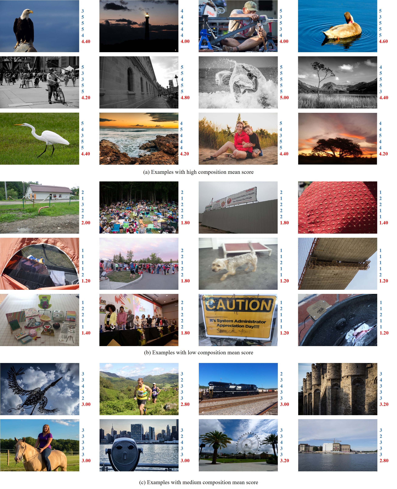
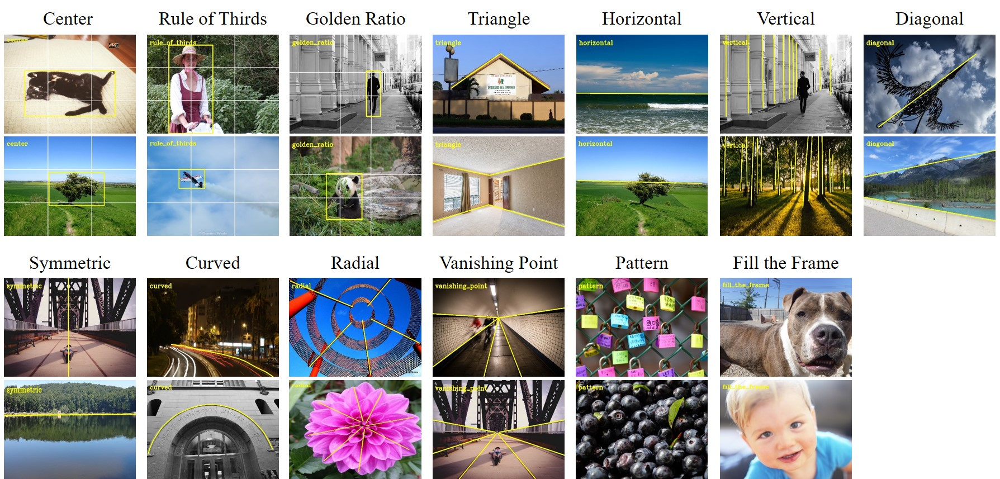
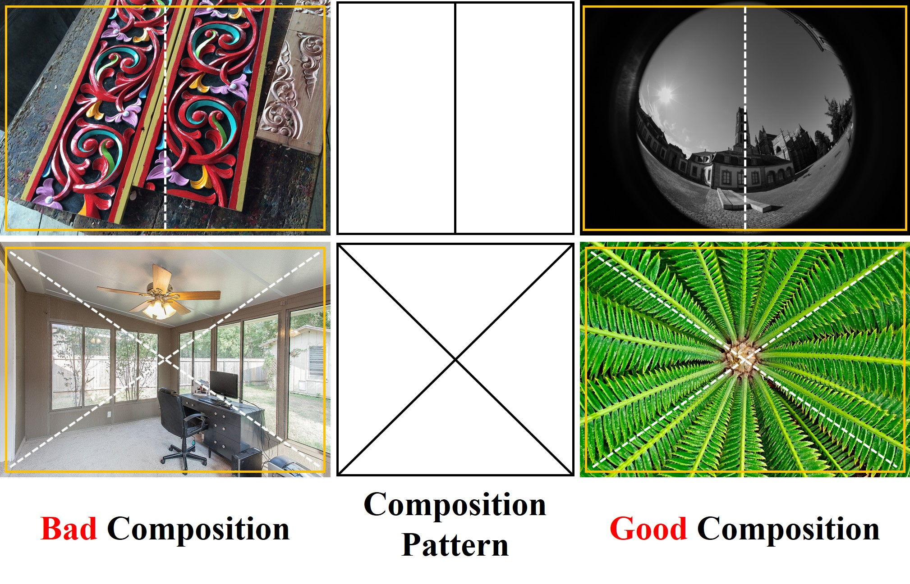
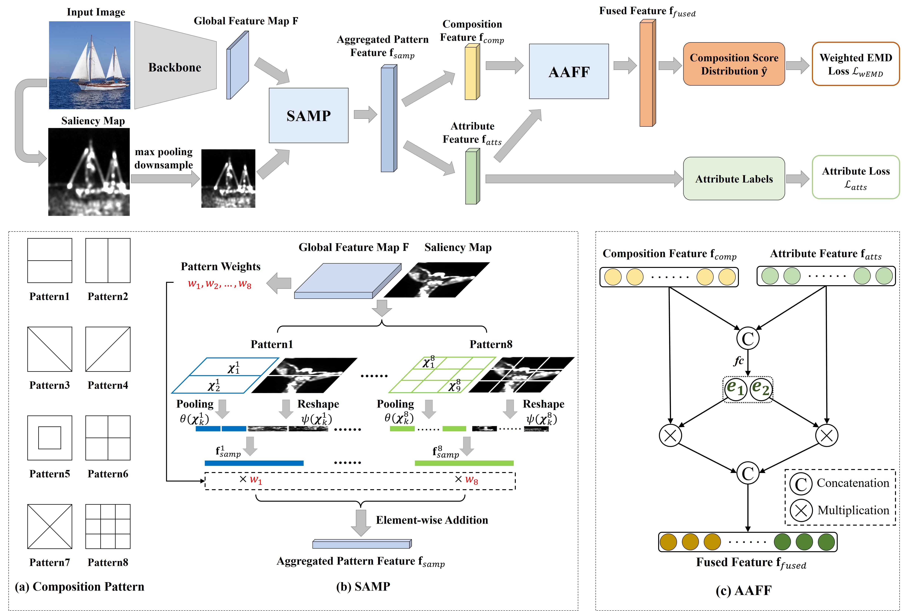
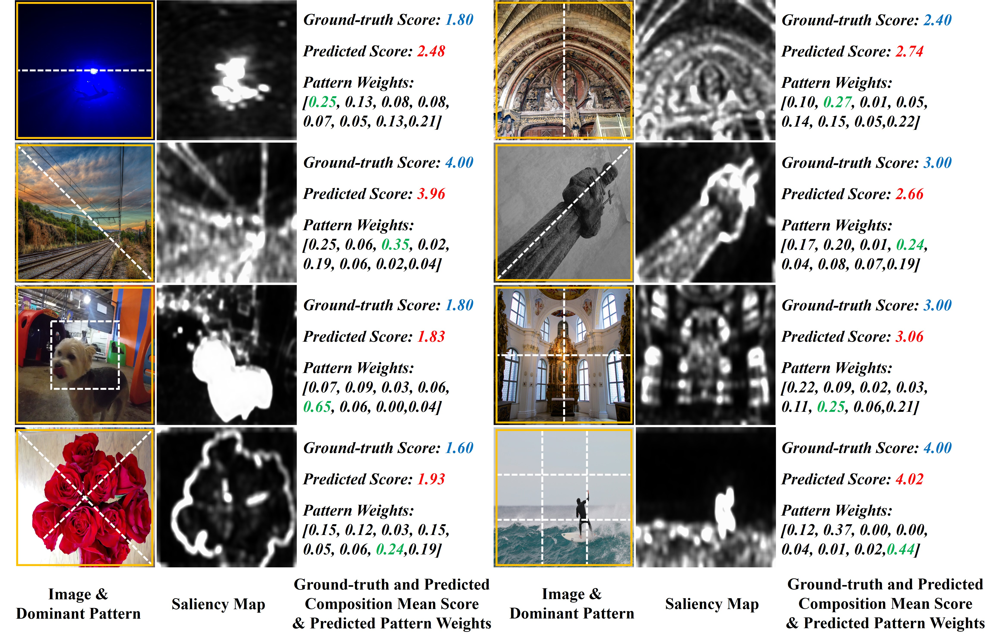

> # Image Composition Assessment Dataset
> Welcomes to the offical homepage of Image Composition Assessment DataBase (**CADB**).
> 
> Image composition assessment aims to assess the overall composition quality of a given image, which is crucial in aesthetic assessment.
> To support the research on this task, we contribute the first image composition assessment dataset. Furthermore, we propose a composition assessment network **SAMP-Net** 
> with a novel Saliency-Augmented Multi-pattern Pooling (**SAMP**) module, which can perform more favorably than previous aesthetic assessment approaches.
> This work has been accepted by BMVC 2021 ([**paper**](https://arxiv.org/pdf/2104.03133.pdf)).

**Update 2022-05-05**: We release the annotations of scene categories, composition classes as well as composition elements for more fine-grained analysis of image composition quality. 

**Table of Contents**

<!-- TOC depthFrom:1 depthTo:6 withLinks:1 updateOnSave:1 orderedList:0 -->

- [Dataset](#dataset)
  - [Introduction](#introduction)
  - [Download](#download)
  - [Visualizing Annotations](#visualizing-annotations)
- [Method Overview](#method-overview)
  - [Motivation](#motivation)
  - [SAMP-Net](#samp-net)
- [Results](#results)
- [Code Usage](#code-usage)
  - [Requirements](#requirements)
  - [Training](#training)
  - [Testing](#testing)
- [Citation](#citation)

# Dataset

## Introduction

We built the CADB dataset upon the existing Aesthetics and Attributes DataBase ([AADB](https://github.com/aimerykong/deepImageAestheticsAnalysis)). CADB dataset contains **9,497** images with each image rated by **5 individual raters** who specialize in fine art for the overall composition quality, in which we provide a **composition rating scale from 1 to 5**, where a larger score indicates better composition. Some example images with annotations in CADB dataset are illustrated in the figure below, in which we show five composition scores provided by five raters in blue and the calculated composition mean score in red. We also show the aesthetic scores annotated by AADB dataset on a scale from 1 to 5 in green.
<div  align="center">

</div>

To facilitate the study of image composition assessment, apart from the composition score, we also annotate scene categories, composition classes as well as elements for each image. Specifically, we carefully select 9 frequently appeared scenes (including ***animal, plant, human, static, architecture, landscape, cityscape, indoor, night***) and 1 *other* class specially refers to images without obvious meaning. As for composition classes, we categorize the common photographic composition rules into 13 classes: ***center, rule of thirds, golden ratio, triangle, horizontal, vertical, diagonal, symmetric, curved, radial, vanishing point, pattern, fill the frame***, and assign *none* class to the images without obvious composition rules, in which each image is annotated with one or more composition classes. Moreover, we annotate the dominant composition elements for each composition class except pattern and fill the frame, as illustrated in the figure below. We mark composition elements in yellow and add white auxiliary gridlines to some composition classes for better viewing.
<div  align="center">

</div>

## Download
Download ``CADB_Dataset.zip`` (~2GB) from 
[[Google Drive]](https://drive.google.com/file/d/1fpZoo5exRfoarqDvdLDpQVXVOKFW63vz/view?usp=sharing) | [[Baidu Cloud]](https://pan.baidu.com/s/1o3AktNB-kmOIanJtzEx98g)(access code: *rmnb*).
The annotations of scene categories, composition classes as well as elements can be found in ``annotations`` folder of this repository.  

## Visualizing Annotations
Put the json files in the ``annotations`` folder into the CADB dataset directory ``CADB_Dataset``. Then we obtain the file structure below:
```
CADB_Dataset
├── composition_elements.json
├── composition_scores.json
├── scene_categories.json
└── images
    ├── 10000.jpg
    ├── 10001.jpg
    ├── 10002.jpg
    ├── ……
```
Visualizing the annotations of composition score, scene category, and composition element:
```bash
python annotations/visualize_cadb_annotation.py --data_root ./CADB_Dataset
```
The visualized results will be stored in ``CADB_Dataset/Visualization``.

# Method Overview

## Motivation
As shown in the following Figure, each **composition pattern** divides the holistic image into multiple non-overlapping partitions, which can model
human perception of composition quality. By analyzing the **visual layout** (e.g., positions and sizes of visual elements) according to composition pattern, i.e., comparing the
visual elements in various partitions, we can quantify the aesthetics of visual layout in terms of **visual balance** (e.g., symmetrical balance and radial balance), **composition rules** (e.g., rule of thirds, diagonals and triangles), and so on. Different composition patterns offer different perspectives to evaluate composition quality. For example, the composition pattern in the top (resp., bottom) row can help judge the composition quality in terms of symmetrical (resp., radial) balance.
<div  align="center">

</div>

## SAMP-Net
To accomplish the composition assessment task, we propose a novel network SAMP-Net, which is named after **Saliency-Augmented Multi-pattern Pooling (SAMP)** module. 
The overall pipeline of our method is illustrated in the following Figure, where we first extract the global feature map from input image by backbone and then yield aggregated
pattern feature through our SAMP module, which is followed by **Attentional Attribute Feature Fusion (AAFF)** module to fuse the composition feature and attribute feature. After that, we predict **composition score distribution** based on the fused feature and predict the attribute score based on the attribute feature, which are supervised by **weighted EMD loss** and Mean Squared Error (MSE) loss respectively.
<div  align="center">

</div>

# Results
We show the input image, its saliency map, its ground-truth/predicted composition mean score, and its pattern weights in below Figure. Moreover, our method predicts the pattern weights which indicate the importance of different patterns on the overall composition quality. For each image, the composition pattern with the largest weight is referred to as its **dominant pattern** and we overly this pattern on the image. The dominant pattern helps to reveal from which perspective the input image is given a high or low score, which further provide constructive suggestions for improving the composition quality. In the left figure of the third row, per the low score under the center pattern, the dog is suggested to be moved to the center.   
<div  align="center">

</div>

# Code Usage
```bash
  # clone this repository
  git clone https://github.com/bcmi/Image-Composition-Assessment-with-SAMP.git
  cd Image-Composition-Assessment-with-SAMP/SAMPNet
  # download CADB data (~2GB), change the default dataset folder and gpu id in config.py.
  ```
## Requirements
- PyTorch>=1.0
- torchvision
- tensorboardX
- opencv-python
- scipy
- tqdm

Or you can refer to [``requirement.txt``](./SAMPNet/requirements.txt).  

## Training
```bash
   python train.py
   # track your experiments
   tensorboard --logdir=./experiments --bind_all
   ```
During training, the evaluation results of each epoch are recorded in a ``csv`` format file under the produced folder ``./experiments``.

## Testing
You can download pretrained model (~180MB) from [[Google Drive]](https://drive.google.com/file/d/1sIcYr5cQGbxm--tCGaASmN0xtE_r-QUg/view?usp=sharing) | [[Baidu Cloud]](https://pan.baidu.com/s/17EzhsbHqwA5aR8ty77fTvw)(access code: *5qgg*). 
```bash
   # place the pretrianed model in the folder ``pretrained_model`` and check the path in ``test.py``.
   # change the default gpu id in config.py
   python test.py
   ```

# Citation
```
@article{zhang2021image,
  title={Image Composition Assessment with Saliency-augmented Multi-pattern Pooling},
  author={Zhang, Bo and Niu, Li and Zhang, Liqing},
  journal={arXiv preprint arXiv:2104.03133},
  year={2021}
}
```
