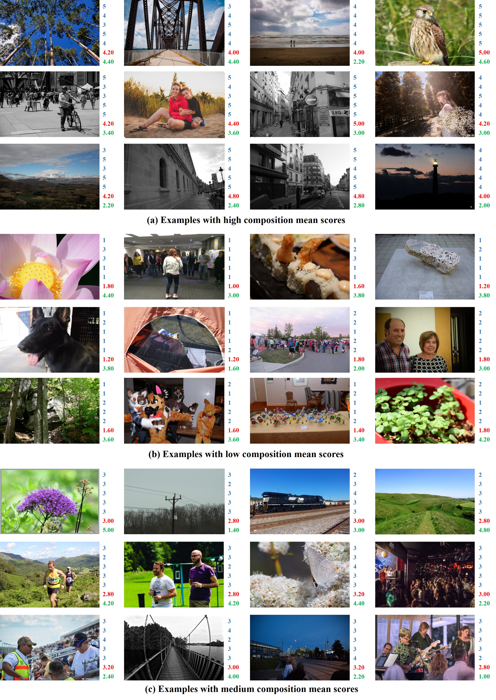

# Image_Composition_Assessment_Dataset

Welcomes to the offical homepage of Image Composition Assessment DataBase (**CADB**).  Image composition assessment aims to assess the overall composition quality of a given image, which is crucial in aesthetic assessment. CADB dataset is built upon the existing Aesthetics and Attributes DataBase ([AADB](https://github.com/aimerykong/deepImageAestheticsAnalysis)), and contains 9,497 images with each image rated by 5 individual raters who specialize in fine art for the overall composition quality. Some example images with annotations in CADB dataset are illustrated in the figure below, in which we show five composition scores ranging from 1 to 5 provided by five raters in blue and the calculated composition mean score in red.

## Research Paper
[Image Composition Assessment with Saliency-augmented Multi-pattern Pooling](https://arxiv.org/pdf/2104.03133.pdf)

Bo Zhang, Li Niu, Liqing Zhang

## Downloads

The CADB dataset and training/testing split are provided in [[Baidu Cloud]](https://pan.baidu.com/s/1XKUR16PC-GA0yLA1RL-WJA)(access code: *rvgn*).
